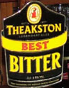

# pvtl-goog-pcf-beer-demo

An idea for a demo of a beer suggester app, based on smart-phone snapshots of beer taps in pubs

## Components
* Google Vision API
* Google Image Search
* Google NLP API
* Pivotal Cloud Foundry
* Spring Cloud Dataflow
* (etc.)

## Problem to Solve
A colleague was in London, walked into a pub, and was unsure of which beer to choose.  Given this
individual's past preferences, coupled with a photo of the beer taps in the pub, suggest the best
choice.

## Scope
Not sure.  We need a demo in short order, so this could be too broad a task to tackle all at once.
We may elect to narrow our focus somewhat.

## Visual Description of the Process
TODO: link to the some images here ...

