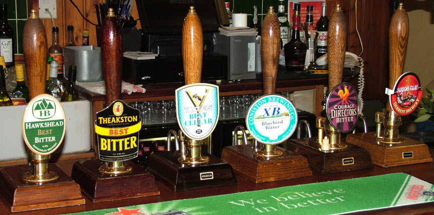
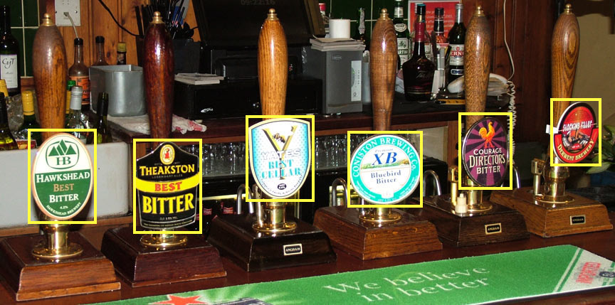
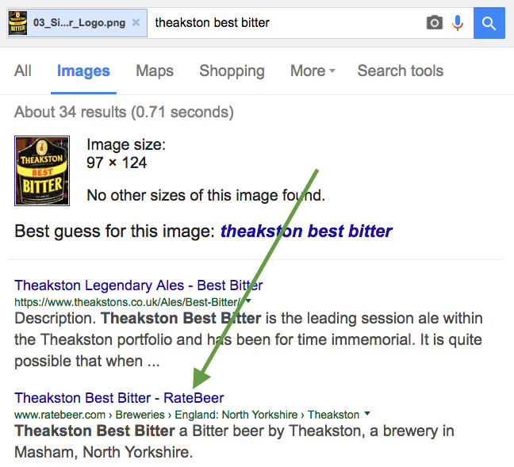
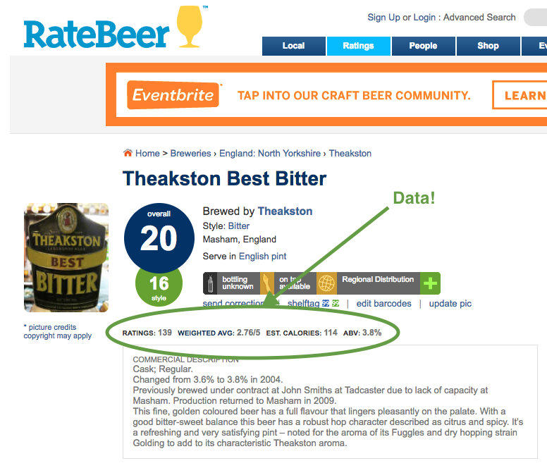

# pvtl-goog-pcf-beer-demo

An idea for a demo of a beer suggester app, based on smart-phone snapshots of beer taps in pubs

_Making the world a better place, one beer recommendation at a time_

## Components
* Google Vision API
* Google Image Search
* Google NLP API
* Pivotal Cloud Foundry
* Spring Cloud Dataflow
* (etc.)

## Problem to Solve
A colleague was in London, walked into a pub, and was unsure of which beer to choose.  Given this
individual's past preferences, coupled with a photo of the beer taps in the pub, suggest the best
choice.

## Scope
Not sure.  We need a demo in short order, so this could be too broad a task to tackle all at once.
We may elect to narrow our focus somewhat.

## Visual Description of the Process
1. Using the app, user snaps a photo of the beer taps

1. Computer based image recognition finds the bounds of each of the beer taps, so they
can be extracted and searched individually

1. Image based search returns the brand and type of beer, along with a link to a beer
ratings web site

1. Rating data for this beer is scraped from the page and stored, keyed to an ID for
this particular beer (form of ID should facilitate "fuzzy" search/retrieval)

